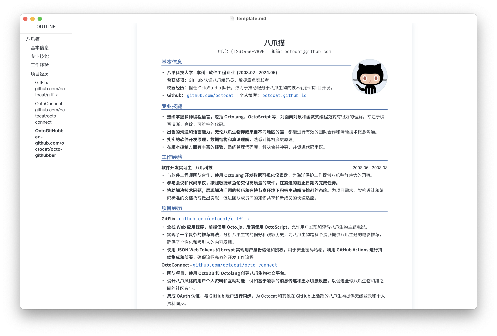

<h1 align="center">
    LapisCV
</h1>
<p align="center">
    📃 开箱即用的 Obsidian / Typora 简历
</p>
### 预览

<div align="center">Obsidian</div>



<div align="center">Typora</div>

- 基于 Markdown 格式，适配 Obsidian / Typora，易于编辑，所见即所得
- 风格简洁正式，适用于大部分求职 / 求学场景

[PDF样例](.assets/preview.pdf)

### 安装与使用

#### Obsidian

下载 Release，将本仓库中的 obsidian 目录作为仓库在 Obsidian 打开即可

#### Typora

1. 下载 Release，设置 Lapis Resume 作为主题（将 lapis-resume.css 与 lapis-resume 目录放入主题文件夹）

2. 打开模版文件 [template.md](typora/template.md) 进行内容编辑，文件 - 导出 - PDF 即可导出 PDF 格式简历文件。

### 格式

- 一级标题：姓名块
- 引用块：联系方式块
- ``：头像，不带头像删除该行即可
- 二级标题：栏标题
- 三级标题：栏内子标题
- 分隔线：**分页标记**，导出 pdf 时将在每个分隔线处进行分页

### 自定义样式

支持自定义样式，便于适配不同体量的单页内容 & 根据喜好调整样式细节

#### Obsidian

// TODO

#### Typora

修改 `lapis-cv.css` 代码文件开头的 `Custom Config` 块对应值并重启 Typora 即可

```css
:root {
    --text-size: 10pt;                      // 文本字体大小
    --line-height: 1.8;                     // 文本行高
    --avatar-width: 29mm;                   // 头像宽度

    --text-color: #353a42;                  // 文本颜色，若需打印请改为纯黑
    --primary-color: #4870ac;               // 主题色
    --link-color: #0563c1;                  // 链接颜色
    --shadow-color: #dae3eac9;
    --border-color: #dae3ea;

    --h1-size: 16pt;                        // 一级标题字体大小
    --h2-size: 12pt;                        // 二级标题字体大小
    --h3-size: 10.5pt;                      // 三级标题字体大小

    --text-font: 'SourceHanSansCN';         // 文本字体
    --title-font: 'SourceHanSerifCN';       // 标题字体
    --link-font: 'JetBrainsMono';           // 链接字体
    --code-font: 'JetBrainsMono';           // 代码字体
}

// 打印时的页边距
@media print {
    @page {
        margin: 12mm 6mm 0 6mm;             // 上边距 左边距 下边距 右边距
    }
}
```

